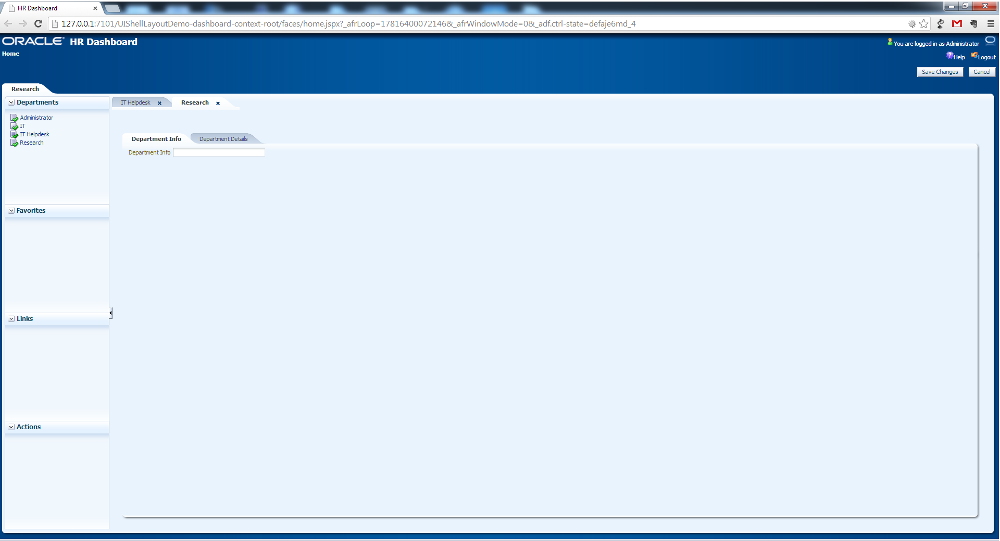
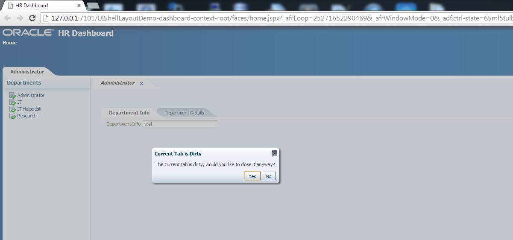
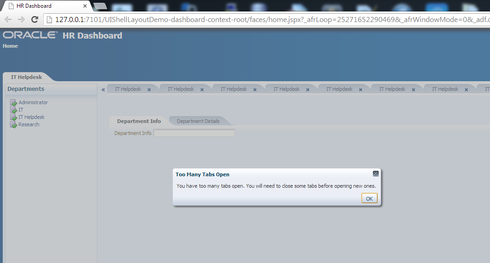

uishell-layout-demo
===================

ADF UI Shell Layout Demo

[UI Shell Patten](http://www.oracle.com/technetwork/developer-tools/adf/uishell-093084.html) is widely adpated in project using ADF. I made this project to figure out how it works and also try to learn ADF layout compoennts more. This project demos most of feature (if not all) of UI Shell Pattern.

Screenshots:

1. Main layout screen 

2. Dirty Tab Warning 

3. Max Tabs Limit Warning

> Note: It is tested on JDeveloper 11.1.1.6 only.

